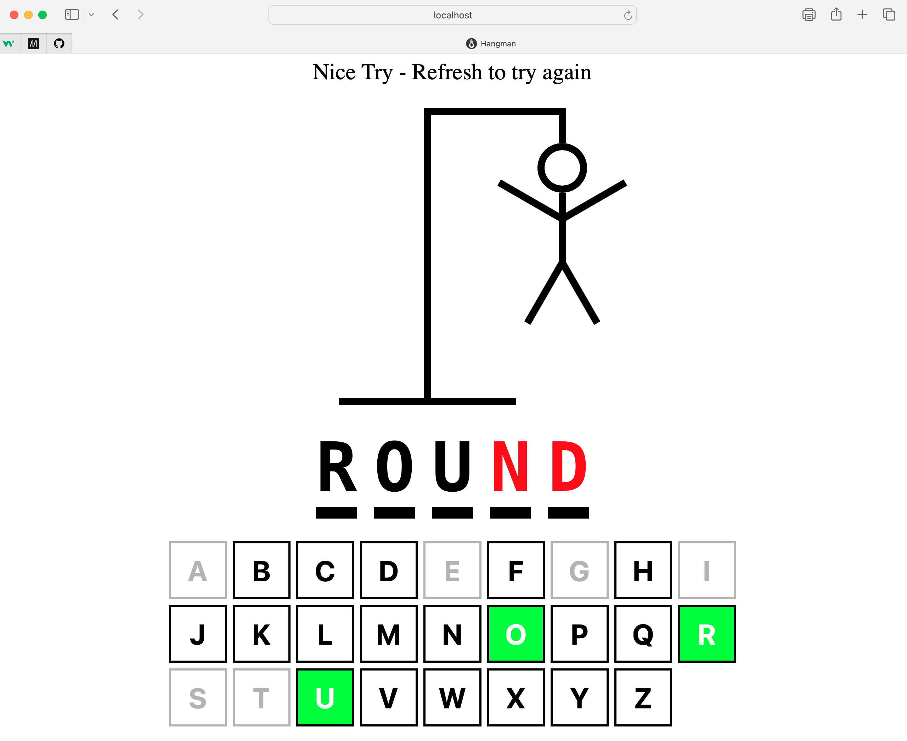

<h1 align="center">
  <br>
  
  <br>
  Hangman
  <br>
</h1>

<h4 align="center">A minimal Hangman game built with React, written in TypeScript.</h4>

<p align="center">
  <a href="#key-features">Key Features</a> •
  <a href="#how-to-use">How To Use</a> •
  <a href="#code-highlights">Code Highlights</a> •
  <a href="#credits">Credits</a>
</p>

<div align="center">

</div>

## Key Features

- A randomly generated word is selected from a database every time the page loads.
- A reactive keyboard is displayed to accept user input.
- A hangman drawing is drawn using CSS after every wrong guess.
- A win/loss message is displayed when the game ends.

## How To Use

To clone and run this application, you'll need [Git](https://git-scm.com) and [Node.js](https://nodejs.org/en/download/) (which comes with [npm](http://npmjs.com)) installed on your computer. From your command line:

```bash
# Clone this repository
$ git clone git@github.com:Logano-7/hangmanTS.git

# Go into the repository
$ cd hangman_ts

# Install dependencies
$ npm install

# Run the app
$ npm run dev
```

> **Note**
> If you're using Linux Bash for Windows, [see this guide](https://www.howtogeek.com/261575/how-to-run-graphical-linux-desktop-applications-from-windows-10s-bash-shell/) or use `node` from the command prompt.

## Code Highlights

```bash
 useEffect(() => {
    // Add event listener for keypress
    const handler = (e: KeyboardEvent) => {
      // Only allow lowercase letters
      const key = e.key
      if (!key.match(/^[a-z]$/)) return

      e.preventDefault()
      addGuessedLetter(key)
    }

    document.addEventListener("keypress", handler)

    return () => {
      document.removeEventListener("keypress", handler)
    }
  }, [guessedLetters])
```

```bash
    const handler = (e: KeyboardEvent) => {
      // Only allow Enter key
      const key = e.key
      if (key !== "Enter") return


      e.preventDefault()
      // Reset the game
      setGuessedLetters([])
      setWordToGuess(getWord())
    }
```

```bash
<button
  onClick={() => addGuessedLetter(key)}
  // Used CSS modules to change the color when active
  className={`${styles.btn} ${isActive ? styles.active : ""} ${
  isInactive ? styles.inactive : ""
            }`}
  disabled={isInactive || isActive || disabled}
  key={key}
  >
```

## Credits

This software uses the following open source packages:

- [Node.js](https://nodejs.org/)
- [React](https://react.dev)
- [TypeScript](https://www.typescriptlang.org)

## You may also like...

- [SmallTalk](https://github.com/Logano-7/smalltalk) - A Full-Stack MERN Chat app with full authentication. Uses Context and local storage to navigate the user. 

- [Gericht](https://github.com/Logano-7/gerichtResturantDesign) - A Modern Figma  restaurant Deisgn

- [Logan's Logs](https://github.com/Logano-7/logsblogs) - A Full-Stack Blog with working authentication using Cookies. Displays Blog posts taken from a SQL Database.

---

> GitHub [@Logano-7](https://github.com/Logano-7) &nbsp;&middot;&nbsp;
> Codewars [@Logano-7](https://www.codewars.com/users/Logano-7) &nbsp;&middot;&nbsp;
> LinkedIn [@Logan Martin](https://www.linkedin.com/in/logan-martin-7-js/)
